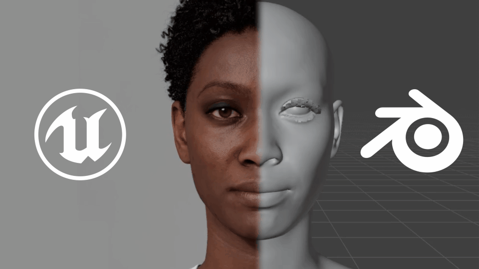

    
    <h1>Character DNA Addon</h1>

 

The Character DNA Addon allows you to import DNA files into Blender with a seamless 1-to-1 integration of the MetaHuman face board and body correctives via [OpenRigLogic](https://github.com/EpicGames/OpenRigLogic).

Now, you can work in Blender and push changes back to your Unreal project through your MetaHuman's DNA. [Get Now](https://polyhammer.com/character-dna-addon).

    

## Overview

Welcome to the project! We are working hard to make this the best solution for customizing MetaHumans for Unreal Engine. [Code contributions](https://docs.polyhammer.com/character-dna-addon/contributing/development/) and suggestions are welcome, and we are excited to work with the community to make this even better!

The base version of the addon is **FREE** and fully supports Blender import and export of `.dna` files. It also fully integrates Epic's OpenRigLogic evaluation system, providing a fast 1-to-1 integration of both the MetaHuman head and body components (just like Unreal Engine). This allows users to use powerful tools like [MetaHuman Animator](https://dev.epicgames.com/documentation/metahuman/metahuman-animator) to drive facial animation directly on their rigs in Blender. This is totally free, and you can install it from our extension server when you create an [account here](https://dashboard.portal.polyhammer.com/).

However, please consider [financially supporting](https://polyhammer.com/character-dna-addon) the project by purchasing the pro version. The pro version contains advanced DNA editors which allow individuals and studios to replace their entire custom MetaHuman pipeline with just Blender. We heavily rely on your support to keep this project going! Thank you!

> [!NOTE]
> The addon is in the final stages of the open beta. The pro version is discounted while in beta; however, purchasing it now still gets you access to lifetime updates.

    

## Support

The addon is compatible with MetaHuman `.dna` files that have been created with MetaHuman Creator in Unreal `5.6`,`5.7` and `5.8`. The current Blender support for the addon is listed below:

| Blender Version | Platform | Architecture |
| --------------- | -------- | ------------ |
| 4.5             | Windows  | x64          |
| 4.5             | Linux    | x64          |
| 4.5             | Mac OS   | arm64        |
| 5.1             | Windows  | x64          |
| 5.1             | Linux    | x64          |
| 5.1             | Mac OS   | arm64        |

## Get Notified on a New Release

Never miss a new addon release! Follow these steps:

1. At the top right of this page, select `Watch`.
1. Select `Custom` from the dropdown.
1. Check `Releases`.
1. Click `Apply`.

You will now get an email notification every time a new version of the addon is released.

## License

The Character DNA add-on is licensed under the [GNU General Public License v3.0](LICENSE.md).

## Third-Party Software & Trademarks

This add-on bundles and redistributes the following third-party components.

* **OpenRigLogic** (DNA and RigLogic libraries) — © Epic Games, Inc., licensed under the [MIT License](https://github.com/EpicGames/OpenRigLogic/blob/main/LICENSE).
* **Sentry SDK for Python** — © Functional Software, Inc. dba Sentry, licensed under the MIT License.
* **ufbx for Python** — MIT License.

Epic Games, Unreal Engine, Fab, MetaHuman, RigLogic, and OpenRigLogic, and their associated design logos,
are trademarks or registered trademarks of Epic Games, Inc. All other trademarks are the property of
their respective owners. This add-on is not affiliated with, endorsed by, or sponsored by Epic Games,
Inc. References to MetaHuman, RigLogic, and OpenRigLogic are made under nominative use solely to
describe compatibility and the origin of the bundled libraries.
