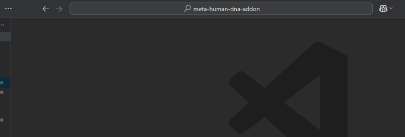
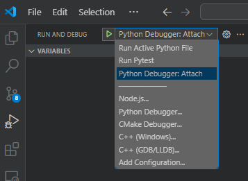

# Development

Contributions are welcome and encouraged. Before performing a significant amount of work, please create a issue on the repo to discuss your idea first. Please open all PRs to our `dev` branch, thank you!

## Pull Request Process
1. Fork the repository.
1. Create a branch in your fork that matches the name of the issue you're working on.
1. Add the new feature or fix.
1. Run the unit tests and ensure that none fail.
1. Submit a pull request from your forked branch back to the `dev` branch of the repository.
1. Include the updated documentation in the pull request.
1. The pull request will be reviewed, then merged into `dev` if all tests pass, the changes will be pushed to the `main` branch and a new versioned build will be made.

!!! note
  
    Any new features require an accompanying unit test for it to be approved.

## Development Dependencies

* [VS Code](https://code.visualstudio.com/download) 

    Alternatively, you can use another Python IDE, but development will be more streamlined in VS Code due to pre-configured profiles and launch settings. Additionally, `debugpy` is integrated into the environments when launching Blender from VS Code, facilitating debugging.

* [Python 3.11](https://www.python.org/downloads/release/python-3117/)
    
    Grab the installer from the provided link.

* [Git](https://git-scm.com/download/win) 

    Ensure that Git LFS is installed. The most recent Git installer typically includes Git LFS by default. When running the installer, opt for the default settings.

* [Blender 4.2](https://www.blender.org/download/)


## VSCode
The repo contains the tasks, launch actions, and settings for developing with vscode. To get setup do the following:

### Setup
1. Install the VSCode profile under `admin/profiles/dev.code-profile`. You can do this by typing `> Profile Import Profile` in the command pallette. This will give you all the vscode extensions you will need.
1. Copy the example `.env.example` file and rename it to `.env`
1. Close and re-open VSCode
1. Type `> Python: Create Environment`, hit enter and chose `Venv` and choose your Python 3.11 installation, then check the box to install the `requirements.txt`
1. Close and re-open your integrated terminal in vscode and ensure that you now have a `(.venv)` prefixing your shell. If you do, you are all setup and ready to go!

### Build Tasks
The VSCode project has build tasks for launching your apps. It is highly recommended that you launch blender and unreal through these, since they will ensure you have the dev dependencies in your python environment for reloading code and debugging. To do this move your cursor over the integrate terminal and press the hot keys `CTRL+SHIFT+B`. 



!!! note
    If you choose yes to debug, the app will hang until you attach to it via debugpy in VSCode. (See Launch Actions)

!!! note
    The launch scripts look for the unreal and blender executables in their default locations. You can override the exe paths by setting
    the `UNREAL_EXE_PATH`, `UNREAL_PROJECT` and `BLENDER_EXE_PATH` variables in a `.env` file in the repo root.

### Launch Actions
Several launch actions have been created for debugging. Use the `Python Debugger: Attach` to attach to the blender after it has been launched from the build tasks and has logged that its waiting for the debugger to attach. There are also a few other debug configurations for the test cases as well.



## Reloading the addon code
If blender was launched from VS Code, then you should be able to run this snippet in the script editor to reload the addon code.

```python
from poly_hammer_utils.helpers import reload_addon_source_code
reload_addon_source_code(['meta_human_dna'])
```