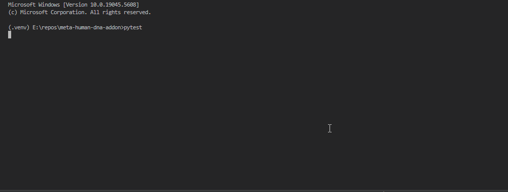

# Testing

Always be sure to run tests locally before opening PRs. Also be sure to add new test cases for new features.

## Running the Test Suite

``` shell
pip install -r requirements.txt
pytest
```
