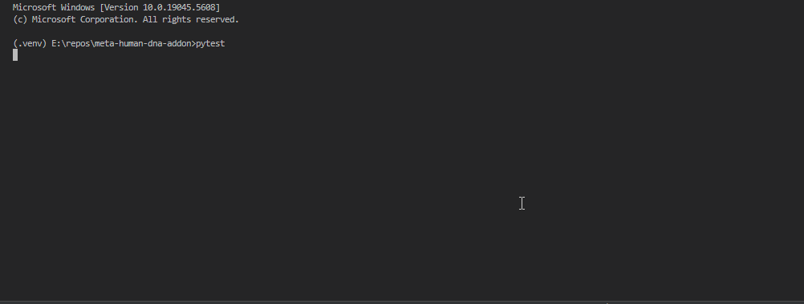

# Testing

Always run the test suite locally before opening a PR, and add test cases for any new feature or fix.

## Running the Test Suite

With the project synced (`uv sync`):

```shell
uv run pytest
```



## With Coverage

Use the **Pytest: With Coverage** VS Code task, or run pytest with the coverage flags against the addon package:

```shell
uv run pytest --cov=src/addons/character_dna --cov-report=html:reports/coverage/html
```

Open `reports/coverage/html/index.html` to review coverage.

!!! note
    New features require accompanying unit tests to be approved. Keep tests close to the behavior they cover and prefer testing through public entry points.
