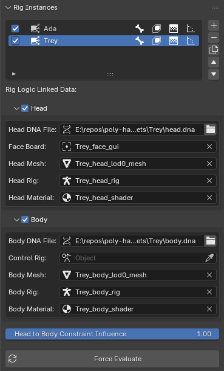

# Rig Instances

A [Rig Instance](../terminology.md#rig-instance) ties together components (i.e., head and body) which in turn trigger their own RigLogic evaluations per `.dna` file. This panel manages the list of instances in your scene and the data each one links to. The sidebar (and every editor panel in it) is context-sensitive to the **active** instance selected here.

{: class="rounded-image center-image"}

## The Instance List

Each row is one Rig Instance. Per-row toggles control what RigLogic outputs for that instance:

| Toggle        | Output                                                                         |
| ------------- | ------------------------------------------------------------------------------ |
| Auto Evaluate | Master switch — evaluate this instance live                                    |
| Bones         | Bone transforms                                                                |
| Shape Keys    | Shape key values                                                               |
| Texture Masks | Wrinkle map masks on the [Texture Logic](../terminology.md#texture-logic) node |
| RBFs          | Radial Basis Function corrective poses (body)                                  |

Use the side buttons to **Add**, **Remove**, **Duplicate**, and reorder instances.

!!! tip
    Always use **Duplicate** to copy an instance — it re-links all data and constraints. Manually duplicating the objects will leave the new head and body disconnected from their underlying DNA relationships.

## Linked Data

Expand the **Head** and **Body** sub-panels to assign the objects each RigLogic evaluation reads from. The header checkbox on each enables auto-evaluation for that component.

### Head

| Field         | Purpose                                                                                  |
| ------------- | ---------------------------------------------------------------------------------------- |
| Head DNA File | The `.dna` file RigLogic reads for the head                                              |
| Face Board    | The armature RigLogic reads [GUI control](../terminology.md#gui-controls) positions from |
| Head Mesh     | The mesh whose shape keys are evaluated                                                  |
| Head Rig      | The armature whose bones are evaluated                                                   |
| Head Material | The material carrying the [Texture Logic](../terminology.md#texture-logic) node          |

### Body

| Field         | Purpose                                                                                                             |
| ------------- | ------------------------------------------------------------------------------------------------------------------- |
| Body DNA File | The `.dna` file RigLogic reads for the body                                                                         |
| Control Rig   | When this is set, the body rig listens for dependency graph updates from this object, which trigger RigLogic updates|
| Body Mesh     | The body mesh                                                                                                       |
| Body Rig      | The body deform armature                                                                                            |
| Body Material | The body material                                                                                                   |

!!! note
    A red/alerted field means required data is missing or a DNA file can't be found on disk. Fields are filled in automatically when you import a DNA file, but you can adjust and re-link data manually. This is important to keep in mind when moving your `.blend` file location, since the `.dna` files are a dependency for the rigs. You can use Blender's relative path syntax to help with this. For example, `//head.dna`, `//body.dna`, etc.

## Head to Body Constraint Influence

When a head and body are imported together, the head is constrained to follow the body's bones. This slider controls how strongly the head follows the body. Setting it to zero detaches it completely from the body.

## Force Evaluate

Forces evaluation for the active [Rig Instance](../terminology.md#rig-instance) and resets its cache. This is the catch-all for refreshing your RigLogic connections and references in case something changed or data is stale.
