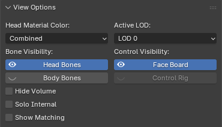

# View Options

Controls what's visible in the viewport for the active [Rig Instance](../terminology.md#rig-instance). These settings are display-only. They don't change your DNA or exported data and are purely there to help you navigate the viewport.

{: class="rounded-image center-image"}

## Head Material Color

Preview which map the head material shows:

- **Combined** — the final shaded result
- **Masks** — the wrinkle map masks
- **Normals** — the normal maps

This can be useful when debugging your wrinkle maps.

## Active LOD

Switch the visible head mesh between its Levels of Detail (**LOD0–LOD7**) and the body mesh between its Levels of Detail (**LOD0–LOD3**).

## Bone Visibility

| Toggle | Effect |
| ------ | ------ |
| Head Bones | Show/hide the head rig's bones |
| Body Bones | Show/hide the body rig's bones |
| Hide Volume | Hide the non-skinned volume/leaf bones to reduce clutter |
| Solo Internal | Hide surface bones to inspect the internal skeleton only |
| Show Matching | Highlight bones that match the active bone (helpful when trying to identify the same bone in another Rig Instance) |

## Control Visibility

| Toggle | Effect |
| ------ | ------ |
| Face Board | Show/hide the face board control rig |
| Control Rig | Show/hide the body control rig |
