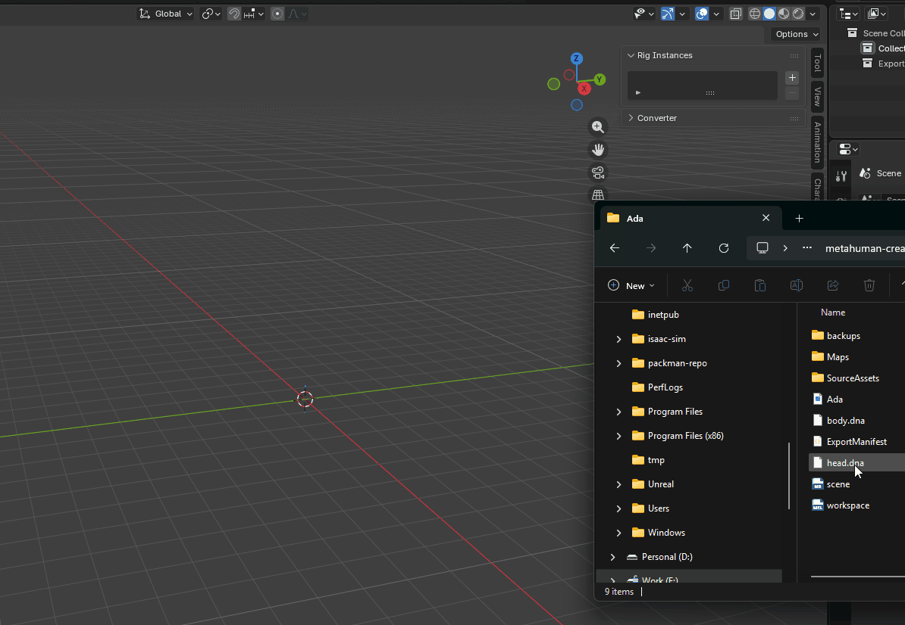

# Character DNA Addon

## Install the Addon in Blender

To install you will need to create an account on the [Poly Hammer Portal](https://dashboard.portal.polyhammer.com/), and then link the extensions server. Follow these [instructions](https://docs.polyhammer.com/poly-hammer-portal/blender-extension-repo).

You will now see a tab on the right-side of the 3D Viewport bar called `Character DNA` (Hide/Show with `N` key.). You will notice that the panels are grayed out and have warning messages. These panels become active when there is an active [RigLogic Instance](./terminology.md/#rig-instance).

## Import a DNA File

The easiest way to get started, is to just drag and drop a `head.dna` file into the blender scene.

{: class="rounded-image"}

If a `Maps` folder exists alongside the `.dna` file, the importer will link any textures that follow the same naming conventions as the MetaHuman source assets exported from MetaHuman Creator.

!!! note
    If you didn't already know, `.dna` files are a proprietary file format created by Epic Games. DNA is an integral part of the MetaHuman identity. DNA files encode all the details of the shape and rig for MetaHuman heads. You can obtain a `.dna` file for your Metahuman by doing a DCC export from [MetaHuman Creator](https://dev.epicgames.com/documentation/metahuman/metahuman-creator){: target="blank"}.

## Congratulations

You now have your first MetaHuman in Blender that is evaluating in real-time just like in Unreal Engine! Your ready to start diving deeper into facial customization!

!!! tip
    Check out our [terminology overview](terminology.md) since we use some pretty Metahuman specific lingo in our docs.
