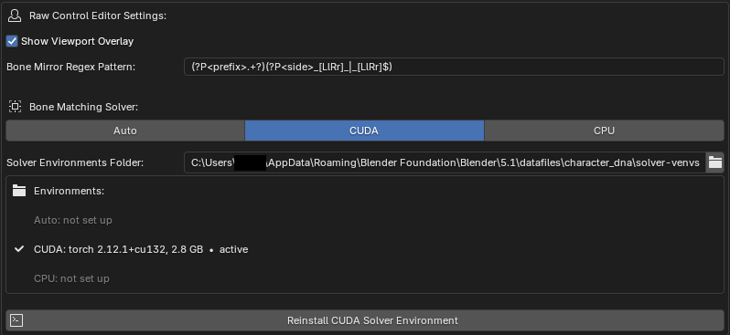

# Raw Editor

!!! info "Pro Feature"
    The Raw Editor is part of the **Pro** edition and only appears when Pro is installed.

Edit the [Raw Controls](../terminology.md#raw-controls) — more specifically **where** bones are posed when a [Raw Control](../terminology.md#raw-controls) is activated to a value of 1.

<video autoplay loop muted playsinline class="rounded-image" style="width:100%" poster="../../images/raw-editor/raw_editor.png">
  <source src="../../images/raw-editor/raw_editor.webm" type="video/webm">
</video>

## Choosing a Raw Control

The list shows every raw control, plus a **Rest Pose** row at the top called `default` for editing the neutral shape. Filter the list by:

- **Mesh** — scope controls to a specific LOD0 mesh.
- **Name** — search a control by name.
- **Non-Zero** — hide-zero-value controls. (This can be useful to find which controls are activated.)
- **Value Sort** — sort by value so you can see which controls have the highest values.
- **Side** — a side filter (Left / Right / Center). Helpful if you only want to work on one side of the face.

Select a control and click **Edit** to open an editing session for that expression's pose.

!!! note
    Some raw controls like `jawOpenExtreme` are "corrective" expressions, so they activate the expressions they add onto (for example, `jawOpen`).

## Editing a Pose

While editing, you have two options: work on **target meshes** (LOD0 sculpt targets) or re-pose the head's **pose bones** directly. The available tools depend on the mode you're in:

**Editing the Target Mesh** — Mirror, Flip, Reset to Neutral, Reset to DNA, Transfer shape from a selected mesh, and (Rest Pose only) Transfer to Head. A **Strength** slider blends the operation result.

**Editing the Pose Bones Directly** — Mirror/Flip bones, Reset to Rest Pose, Reset to DNA, Mirror/Flip selection, and (Rest Pose only) Snap Bones to Surface.

When done, **Commit** writes the change into the DNA, or **Revert** discards it. Options let you mirror on commit and, for Rest Pose edits, update the mesh and auto-update LODs.

## Bone Matching Solver

Instead of posing bones by hand, let the solver find the bone transforms that best fit a target mesh sculpt.

<video autoplay loop muted playsinline class="rounded-image" style="width:100%" poster="../../images/raw-editor/bone_matching_solver.png">
  <source src="../../images/raw-editor/bone_matching_solver.webm" type="video/webm">
</video>

Sculpt your target mesh, then click **Match Bones to Mesh**. It runs a hyper-optimization algorithm to solve the bone transforms that reproduce your sculpt. The **Solver Settings** popover exposes the hyperparameters:

| Setting | Purpose |
| ------- | ------- |
| Iterations | Number of optimization steps |
| Learning Rate | Optimization step size |
| Rotation / Translation Reg | Regularization to keep the solve stable |
| Warm Weight Threshold | Threshold for warm-start weighting |
| Huber Delta (cm) | Robustness of the loss to outliers |
| Convergence Tolerance | When to stop early |

Enable **Reset Pose** to start each solve from the DNA pose, or disable this to start the solve from the current pose bone positions in the Blender scene.

!!! tip
    Start with the defaults. If the fit undershoots, raise iterations or learning rate; if it gets unstable or spiky, raise the regularization.

## Setup and Hardware

The bone matching process happens in another Python subprocess that utilizes [PyTorch](https://pytorch.org/) for accelerating compute on your hardware. This includes options for `CPU`, `CUDA`, and `MPS` on macOS. Setting this to `AUTO` will try to install the dependencies for the most optimal hardware that you have available.

{: class="rounded-image center-image"}

You will have to run the installation process once before you can use the `Match Bones to Mesh` operator. If you have a preference for where the virtual environments should be on disk (these can be several GB), you can set that in the **Solver Environments Folder** preference.
