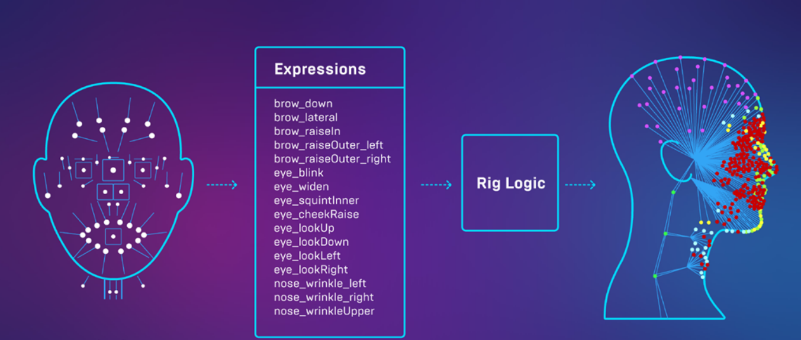
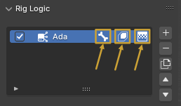
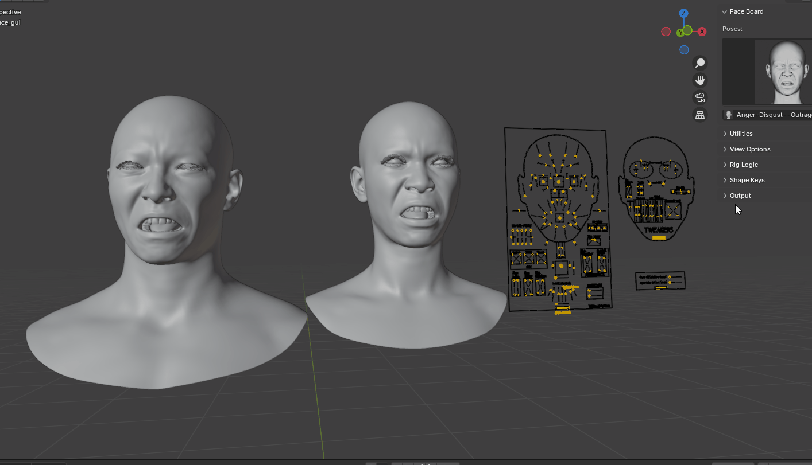
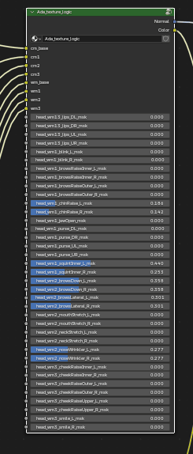
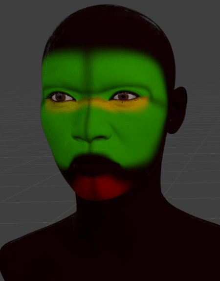

# Terminology

## DNA
Rig Logic relies on a universal set of rules for defining the muscular system of a human face, and on a proprietary file format from 3Lateral called MetaHuman DNA, which is designed to store the complete description of a 3D object's rig and geometry.

## RigLogic
This is the runtime evaluation system that powers Metahuman face rigs. The source for this ships as a Unreal Engine plugin. For the curious, here is the [white paper](https://cdn2.unrealengine.com/rig-logic-whitepaper-v2-5c9f23f7e210.pdf){: target="blank"} where you can read further.

{: class="rounded-image"}

However for the purposes of this addon, the most important thing to understand is that RigLogic ties together the relationships between 4 things. 1 input that drives 3 outputs.

* Face Board GUI Controls (Ultimately these are the "Expressions" or "[Control Curves](https://dev.epicgames.com/documentation/en-us/metahuman/control-curves-driven-by-metahuman-animator?application_version=1.0)")

The Face board drives the following:

* Bone Transforms (It calls these joints, but Blender calls them bones.)
* Shape Key Values (It calls these Blend Shapes, but Blender calls these Shape Keys.)
* Wrinkle Map Masks (These are drive by the addon's "[Texture Logic](#texture-logic)" Node)

The best way is to see this in action is by toggling each of these booleans on your [Rig Logic Instance](#rig-logic-instance). These will enable/disable those particular outputs from the Rig Logic evaluation. This becomes apparent when an animation is playing or you move the Face Board controls.

{: class="rounded-image center-image"}

## Rig Logic Instance

This is a data block that we use in the Blender Addon to ultimately tie together which data belongs to which RigLogic evaluation. This is important, since the addon actually allows you to have multiple "Rig Logic Instances" in your scene at a time, and each Rig Logic Instance reads from a separate DNA file. Also the side bar GUI in the viewport is context sensitive to which "Rig Logic Instance" is actively selected in the list view under the `Rig Logic` panel. So only the active instance will have its properties modified.

{: class="rounded-image"}

## Texture Logic
This a special node that you can add to your materials that blends the output of 3 color map's and 3 normal map's variants based on the current Rig Logic evaluation.

**Black** -  Base Map

**Red**{: class="red"} - Wrinkle Map 1

**Green**{: class="green"} - Wrinkle Map 2

**Blue**{: class="blue"} - Wrinkle Map 3

{: class="rounded-image"}
{: class="rounded-image"}

## GUI Controls
These are the high-level controls. The pose bones on the face board object.

## Raw Controls
These are the low-level controls on the head rig and head mesh:

* Pose Bones
* Shape Keys
* Wrinkle Map Masks