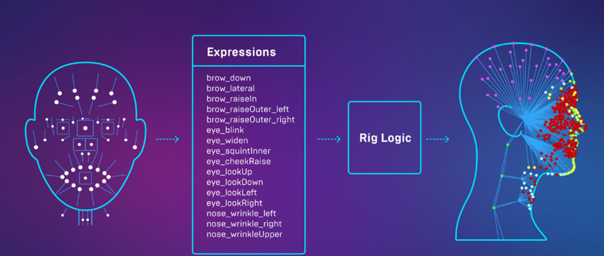
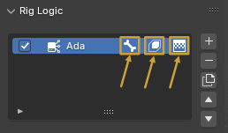

# Terminology

We use MetaHuman-specific lingo throughout these docs. This page defines the core concepts you need to know to use our addon. However, please always consult the official [MetaHuman Documentation](https://dev.epicgames.com/documentation/metahuman/metahuman-documentation) by Epic Games.

## DNA

MetaHuman DNA is a proprietary file format from Epic Games that stores the **complete description of a character's rig and geometry** — meshes, joints, blend shapes, skin weights, texture masks, and the RigLogic rules that tie them together. RigLogic reads a `.dna` file to evaluate a face or body.

## Rig Logic

The runtime that powers MetaHuman face rigs. [OpenRigLogic](https://github.com/EpicGames/OpenRigLogic) is open-sourced by Epic Games and is what this addon uses as the **evaluation module**, so results match Unreal Engine 1-to-1. Epic's [white paper](https://cdn2.unrealengine.com/rig-logic-whitepaper-v2-5c9f23f7e210.pdf){: target="blank"} gives a deep dive into the design of RigLogic.

{: class="rounded-image center-image"}

The key idea: RigLogic converts a small set of high-level **inputs** into a large set of low-level **outputs**. One input layer drives many output layers.

**Inputs (face board GUI controls).** These GUI controls map to [Raw Control](https://dev.epicgames.com/documentation/en-us/metahuman/control-curves-driven-by-metahuman-animator) values when you pose the face board.

**Outputs (driven by the inputs):**

* **Bone Transforms** — RigLogic calls these *joints*; Blender calls them *bones*.
* **Shape Key Values** — RigLogic calls these *blend shapes*; Blender calls them *shape keys*.
* **Wrinkle Map Masks** — driven through the addon's [Texture Logic](#texture-logic) node.

Toggle each of these outputs on your [Rig Instance](#rig-instance) to see its individual contribution while an animation plays or when you move a control.

{: class="rounded-image center-image"}

### How an expression is evaluated

Under the hood, RigLogic runs each pose through a few stages. You don't need to know the math to use the addon, but understanding the vocabulary helps:

* **PSDs (Pose Space Deformations)** — are expressions that represent complex poses and how they are corrected. They define how multiple different expressions should be combined together. This is why editing one shape can affect the final result of others (see the [Shape Key Editor](./pro-features/shape-key-editor.md)).

### LODs

A DNA stores multiple [Levels of Detail](https://en.wikipedia.org/wiki/Level_of_detail_(computer_graphics)) (LOD0–LOD7). LOD0 is the source of truth as far as the Blender addon is concerned. The addon calibrates lower LODs from your LOD0 edits.

!!! note
    *Update LODs* is a Pro feature.

## Rig Instance

A Rig Instance is the data block the addon uses to tie together which scene data belongs to which RigLogic evaluation. You can have **multiple Rig Instances** in one scene, each reading from its own DNA file, and a single Rig Instance can hold more than one RigLogic evaluation (a head and a body, for example).

The `Character DNA` sidebar is **context-sensitive to the active Rig Instance** selected in the [Rig Instances](./free-features/rig-instances.md) panel — only the active instance's properties are shown and modified.

## Texture Logic

A special material node that blends 3 color-map and 3 normal-map variants based on the current RigLogic evaluation, producing animated wrinkle maps. The masks decide where each variant shows through:

**Black** — Base Map

**Red**{: class="red"} — Wrinkle Map 1

**Green**{: class="green"} — Wrinkle Map 2

**Blue**{: class="blue"} — Wrinkle Map 3

  
  

See [Customizing Materials](./workflows/customizing-materials.md) for setup and naming conventions.

## GUI Controls

The yellow pose bones on the face board object. These are the high-level **inputs** to RigLogic.

## Raw Controls

These are ultimately the true **inputs** to RigLogic but are conventionally driven by GUI Controls via a mapping defined in the DNA. All these **outputs** below are calculated based on the Raw Control values:

* Pose Bone Transforms
* Shape Keys
* Wrinkle Map Masks
* PSD Correctives (Which affect the combinations of the 3 things above)
