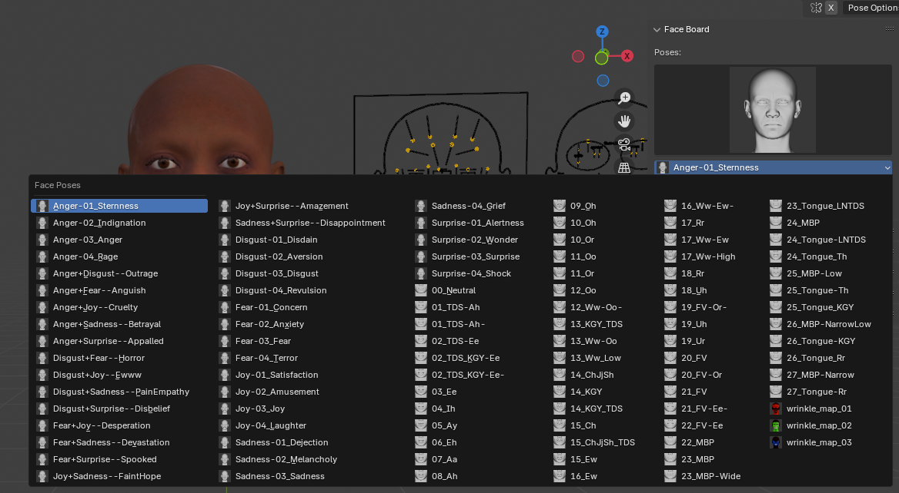
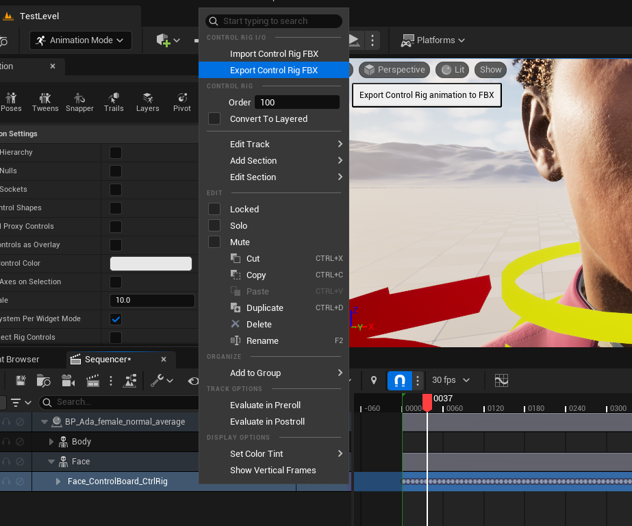
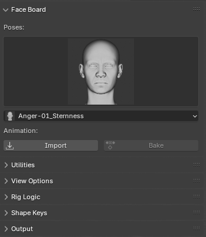
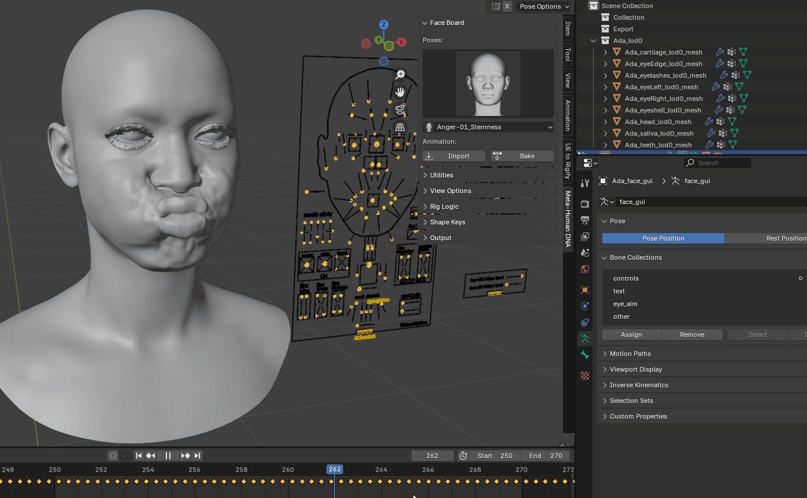

# Face Board

{: class="rounded-image"}

## Properties
### Active Pose
Selecting a value from either the thumbnail preview or enum dropdown will set the face board values to the chosen pose.

!!! tip
    The last 3 poses `wrinkle_map_01`, `wrinkle_map_02`, and `wrinkle_map_03` can be used as the base mesh shapes for your high poly sculpts or scans that you would then bake down to the texture image nodes in the material.

## Operators

### Import Animation
Import an animation for the metahuman face board exported from an Unreal Engine Level Sequence.

{: class="rounded-image" style="width:400px"}
{: class="rounded-image" style="width:290px"}

### Bake Animation
Bakes the active face board action to the pose bones, shape key values, and texture logic mask values. Useful for rendering, simulations, etc. where rig logic evaluation is not available.

{: class="rounded-image"}