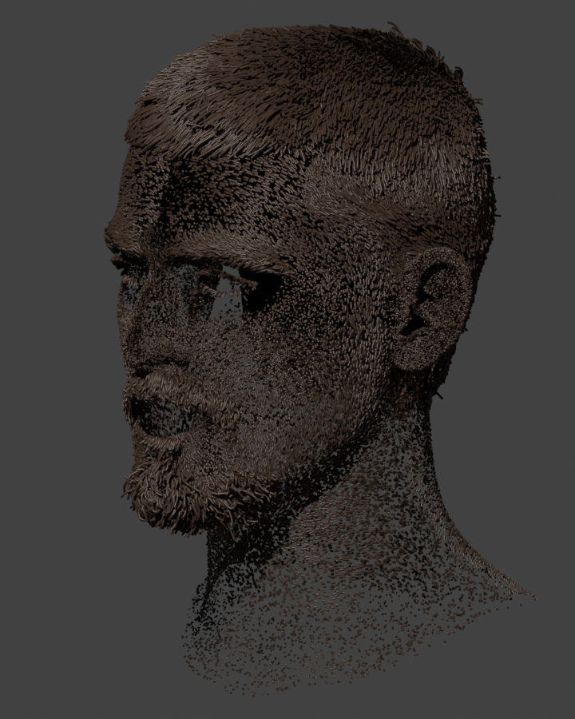

# Groom Import

Import MetaHuman **grooms** (scalp hair, eyebrows, eyelashes, beard, mustache,
peach-fuzz) that were authored in Unreal Engine and bring them into Blender as
native **hair Curves**, attached to the imported head.

{: class="rounded-image center-image"}

This panel lives under the **Output** group in the Character DNA N-panel.

!!! note
    Groom strand geometry is **not** part of the `.dna` file — it lives in Unreal
    `GroomAsset` packages. So importing a groom is a two-step workflow: first run
    the one-time Unreal **groom export commandlet** (`tools/groom_exporter`, see
    its `README.md`) to write an export folder, then point this panel at that
    folder. The add-on never calls Unreal at runtime.

## Properties

### Groom Folder

The folder produced by the groom export commandlet. It contains a
`groom_manifest.json` plus one `.cdgr` geometry file per groom. The importer reads
the manifest and imports the **highest-detail** representation of each groom
(full render strands, preferred over hair cards).

### Attach to Head

When enabled, each imported hair Curves object's **surface** is set to the active
rig instance's head mesh, and its `surface_uv_map` is set to the head's active UV
map. This anchors the strand roots to the scalp by UV so they follow the head when
it deforms (add a *Deform Curves on Surface* node to drive the deformation).

## Operators

### Import Groom

Imports the grooms from the **Groom Folder** onto the active rig instance. Each
groom becomes a hair Curves object under a `<instance_name>_grooms` collection.
Strand point positions are converted from Unreal's space (centimetres, Z-up,
left-handed) into Blender's space (metres, Z-up, right-handed), widths become the
point `radius`, and root UVs become `surface_uv_coordinate`. Re-importing replaces
the collection's contents rather than duplicating them.

!!! tip
    Import the head from its `.dna` file first (so the head mesh exists to attach
    to), set it as the rig instance's **Head Mesh**, then import the groom.

## What transfers, and what doesn't

Both Unreal and Blender model hair as "arrays of curves with per-curve/per-point
attributes", so the curve geometry transfers faithfully:

- **Transfers exactly:** strand point positions, per-strand topology, group
  separation (`groom_group_id` attribute), root UVs, and lengths/scale/position.
- **Approximate / optional:** strand widths (export them with the commandlet's
  `-Widths` flag; otherwise a small default radius is used).
- **Does not transfer:** Unreal's runtime strand interpolation, LOD/card/mesh
  tiers, and the binding/physics deformation solver. Root *positions* are
  reproduced; deformation *behavior* is re-derived in Blender.
