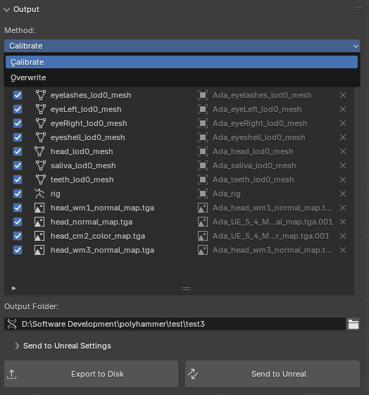
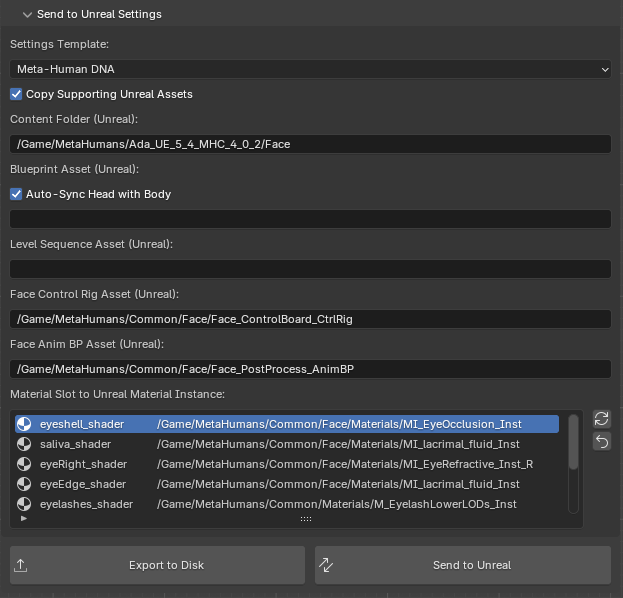

# Output
This panel contains all the properties and operators that control how data is output from Blender.

## Properties
#### Method
The output method to use when creating the dna file

1. **Calibrate** - Uses the original dna file and calibrates the included bones and mesh changes into a new dna file. Use this method if your vert indices and bone names are the same as the original DNA. This is the recommended method.

2. **Overwrite** - Uses the original dna file and overwrites the dna data based on the current mesh and armature data in the scene. Use this method if your vert indices and bone names are different from the original DNA. Only use this method when calibration method is not possible.

!!! warning
    The `overwrite` method is very new and still experimental. This currently doesn't work in all cases and is still being worked on.

#### Asset List
This displays a list of all the mesh object, the armature object, and images that will be output during the export process. Asset and be un-checked to exclude them from the export. Also, the name on the left is editable.

!!! note
    Mesh names should follow the LOD naming convention that metahuman use. This is how the exporter know which LOD level to assign a mesh too.

#### Output Folder
This is a single path to the folder where all the data will be exported. The `.dna` file will be put in this folder, using the name of the [Rig Logic Instance](./../terminology#rig-logic-instance), as well as the `vertex_colors.json`.

Textures are exported to a `maps` folder within this directory.

When the [Send to Unreal](#send-to-unreal) operator is used, the FBX files as well as the minimal DNA (only includes bone position updates) are exported to a `export` folder within this directory.

## Operators
### Export to Disk
This exports only a `.dna` file. The DNA file will contain all aspects according to the [Method](#method) chosen.

### Send to Unreal
This exports a minimal `.dna` with only changes to the bone positions, and the rest of the Mesh data is exported via FBX. This is then ingested remotely along with post import automation of settings.

## Send to Unreal Settings

The [Send to Unreal Addon](https://github.com/poly-hammer/BlenderTools) is a free blender addon that makes sending data to unreal super easy. We wrote a [extension](https://poly-hammer.github.io/BlenderTools/send2ue/customize/extensions/) for it that automates the steps needed to export your Metahuman's Face and import it and its new DNA into Unreal Engine.

Please read the [Quick Start](https://poly-hammer.github.io/BlenderTools/send2ue/introduction/quickstart/) on their documentation and get it all setup and working before continuing further.

### Copy Supporting Unreal Assets
Whether to copy the referenced unreal assets (Control Rig, Anim BP, Materials Instances etc.) to the same folder as the face skeletal mesh asset if they dont already exist. This should be preferred, it is not a good idea to import on top of the original metahuman common assets, however if you have a custom setup with different asset references, you can disable this option.

### Content Folder
The content folder in your unreal project where the assets will be imported. All data is copied or import here.

### Blueprint Asset
The asset path to the Metahuman Blueprint asset that the SkeletalMesh data will be bound to. If left empty, the blueprint will be created in the same folder as the SkeletalMesh asset.

### Level Sequence Asset
The asset path to the Level Sequence that the blueprint actor will be added too. If the level sequence does not exist, it will be created. If left empty the blueprint will not be spawned into a level sequence.

### Face Control Rig Asset
The asset path to the Metahuman Face Board Control Rig asset that will drive the SkeletalMesh data. Note: if [Copy](#copy-supporting-unreal-assets) is on, this is the location to copy from and into the [Content Folder](#content-folder) rather than the actual path to the asset.

### Face Anim BP Asset
The asset path to the Face Post Process Animation Blueprint asset that will drive the SkeletalMesh data. Note: if [Copy](#copy-supporting-unreal-assets) is on, this is the location to copy from and into the [Content Folder](#content-folder) rather than the actual path to the asset.

### Material Slot to Unreal Material Instance
This is a mapping between the material slot name in Blender and the respective Material (or Material Instance) asset path in the Unreal Project. The refresh button on the side can be used to update the list if you re-named certain materials in blender. Also each material asset path can be customized. Note: if [Copy](#copy-supporting-unreal-assets) is on, this is the location to copy materials from and into the [Content Folder](#content-folder) rather than referencing these actual paths to the material asset.