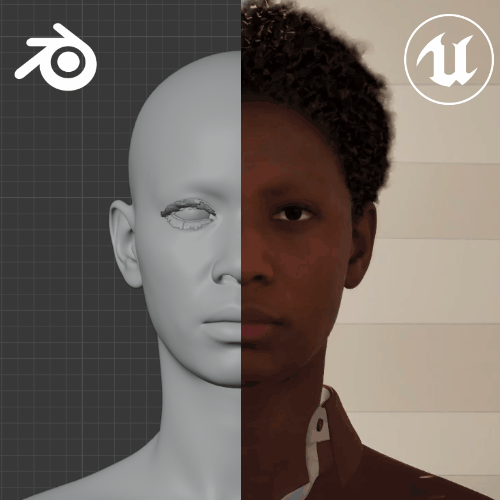
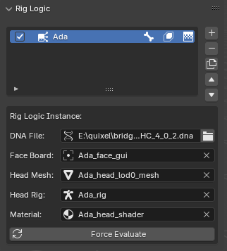
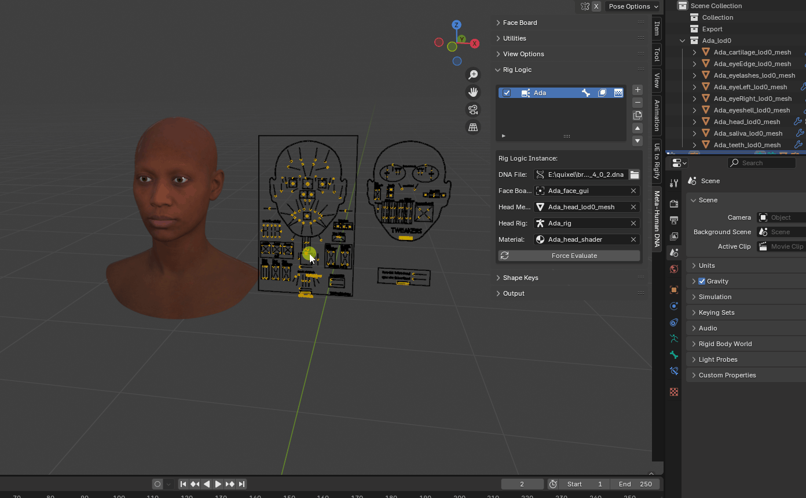

# Rig Logic

[Rig Logic](../terminology.md/#rig-logic) and [Rig Logic Instances](../terminology.md/#rig-logic-instance) and how they interact with DNA are at the heart of this addon. This addon utilizes the same RigLogic evaluation module as Unreal Engine, making the math match 1-to-1 with blender. Rig Logic Instances and their related data are managed under the `Rig Logic` Panel.

{: class="rounded-image center-image" style="width:390px"}
{: class="rounded-image center-image" style="width:352px"}

## Properties
The properties in this panel are the 3 outputs: 

* Head Mesh -> Shape Keys
* Head Rig -> Bone Transforms
* Material -> Wrinkle Maps Mask on the [Texture Logic Node](../terminology.md/#texture-logic)

With the Face Board acting as the controls curve inputs, all evaluated through a RigLogic instance with the chosen DNA file in it's reader.

### DNA File
The path to the DNA file that rig logic reads from when evaluating the face board controls.

### Face Board
The face board that rig logic reads control positions from.

### Head Mesh
The head mesh with the shape keys that rig logic will evaluate.

### Head Rig
The armature object that rig logic will evaluate.

## Operators

### Force Evaluate
Force the active Rig Logic Instance to evaluate based on the face board controls.

## FAQ

### My Face Board isn't evaluating

There are a few things to check:

{: class="rounded-image center-image"}

1. The Face GUI is a armature object, and you will need to select it and then switch to pose mode to select the yellow controls.
1. Make sure a control is actually selected (should be bright yellow, then you can hit `G` key to grab/move a control)
1. Make sure the RigLogic instance does not have evaluation turned off (The blue check box in front of the instance in the list view)
1. Click `Force Evaluate`. This shouldn't be necessary if everything is working correctly, but there could be an error that puts this in a bad state and a `Force Evaluate` should reset and re-cache everything.

!!! note
    In the case where `Force Evaluate` is needed, we would want to know that caused this error in the first place, so providing any log output from the console in a Github issue would be helpful in helping us find the root issue.