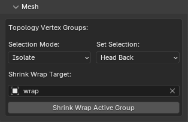
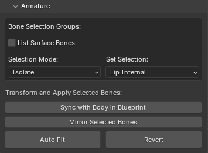

# Utilities

These are one-off operations that can be used during the customization process.

!!! warning
    These are changing more rapidly than other parts of the tool, and some of these may be removed.

## Mesh
{: class="rounded-image"}

## Armature
{: class="rounded-image"}

### Sync with Body Blueprint
Syncs the spine bone positions with the body skeleton in the unreal blueprint. This can help ensure that your head matches the body height. You must have the blueprint asset path set in your Send to Unreal Settings so it knows where to look for the bone positions.
!!! Note
    This requires the Send to Unreal addon to be installed and your unreal project to be open with python remote execution enabled.

### Mirror Selected Bones
Mirrors the selected bone positions to the other side of the head mesh.

### Auto Fit
Auto-fits the selected bones to the head mesh

### Revert
Revert the selected bone's transforms to their values in the DNA file.
