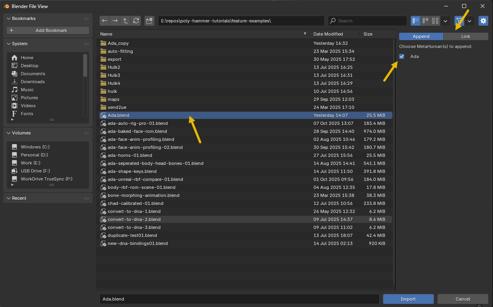

# Append & Link

On a production, you'll often set up an asset in one `.blend` file and then bring it into another `.blend` file. For MetaHumans, you need to use the **Append** or **Link** operation to do this correctly since there is more than just Blender data involved, and the DNA file relationships need to be reconfigured.

## How To

Open **File → Import → MetaHuman Append/Link (.blend)** and select a `.blend` file instead of a `.dna`. You'll see a list of MetaHumans available in that file. Pick one and choose the operation:

- **Append** — copy the MetaHuman into the current file (independent copy).
- **Link** — reference the MetaHuman from the source file (updates propagate).

## Keep the Collection Names Intact

!!! warning
    Append/Link only works when the MetaHuman keeps the **collection names** the importer created. Renaming or re-nesting those collections breaks this operator's ability to append or link all data correctly.

If you need to organize your outliner, do it **without renaming** the MetaHuman's generated collections or moving its rigs out of them. You can change a MetaHuman's name directly on its entry in the [Rig Instances](../free-features/rig-instances.md) panel.
