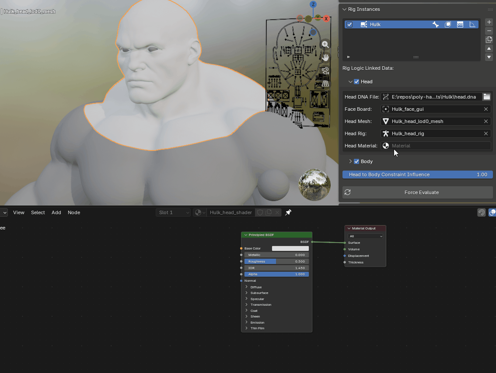
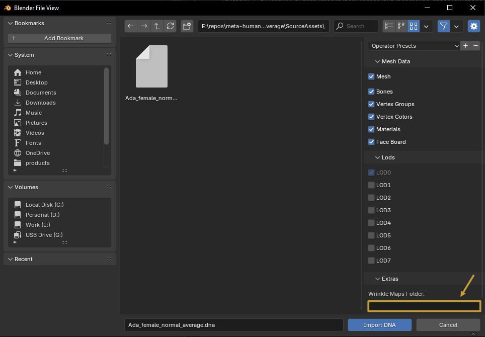

# Customizing Materials

Textures feed the [Texture Logic](../terminology.md#texture-logic) node, which blends color and normal map variants to produce animated wrinkle maps as RigLogic evaluates.

  
  

## Custom Materials

You can build a fully custom material node tree. Just add one [Texture Logic](../terminology.md#texture-logic) node to the graph and link your material in the [Rig Instance](../free-features/rig-instances.md) outputs.

{: class="rounded-image center-image"}

With that connected, RigLogic updates the wrinkle map masks for you as the GUI controls are evaluated.

## Importing Textures

When importing or converting a mesh, you can set the `Maps` folder location. By default, if a `Maps` folder sits alongside the `.dna` file, the importer uses it; otherwise, point it at your folder.

{: class="rounded-image center-image" style="width:500px"}

The importer links any `.tga` or `.png` textures to the [Texture Logic](../terminology.md#texture-logic) node inputs that follow one of these naming patterns:

### Pattern 1

| Texture File                    | Maps To     |
| ------------------------------- | ----------- |
| Head_Basecolor.png              | Color_MAIN  |
| Head_Basecolor_Animated_CM1.png | Color_CM1   |
| Head_Basecolor_Animated_CM2.png | Color_CM2   |
| Head_Basecolor_Animated_CM3.png | Color_CM3   |
| Head_Normal.png                 | Normal_MAIN |
| Head_Normal_Animated_WM1.png    | Normal_WM1  |
| Head_Normal_Animated_WM2.png    | Normal_WM2  |
| Head_Normal_Animated_WM3.png    | Normal_WM3  |

### Pattern 2

| Texture File    | Maps To     |
| --------------- | ----------- |
| Color_MAIN.tga  | Color_MAIN  |
| Color_CM1.tga   | Color_CM1   |
| Color_CM2.tga   | Color_CM2   |
| Color_CM3.tga   | Color_CM3   |
| Normal_MAIN.tga | Normal_MAIN |
| Normal_WM1.tga  | Normal_WM1  |
| Normal_WM2.tga  | Normal_WM2  |
| Normal_WM3.tga  | Normal_WM3  |

### Pattern 3

| Texture File            | Maps To     |
| ----------------------- | ----------- |
| head_color_map.tga      | Color_MAIN  |
| head_cm1_color_map.tga  | Color_CM1   |
| head_cm2_color_map.tga  | Color_CM2   |
| head_cm3_color_map.tga  | Color_CM3   |
| head_normal_map.tga     | Normal_MAIN |
| head_wm1_normal_map.tga | Normal_WM1  |
| head_wm2_normal_map.tga | Normal_WM2  |
| head_wm3_normal_map.tga | Normal_WM3  |
